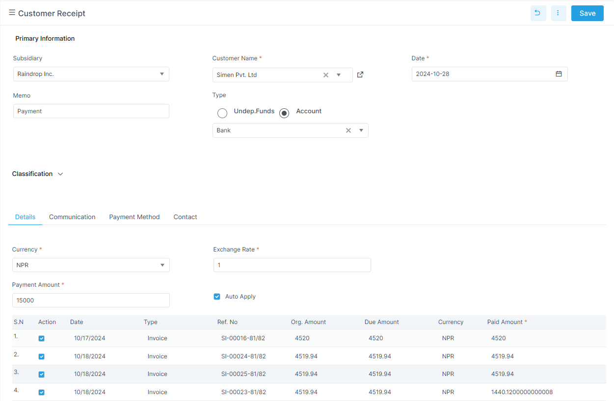

# Payment

The Payment module handles customer and vendor money movement.

## Before you start

- Confirm the related invoice or bill exists.
- Confirm the deposit or payment account is correct.
- Confirm the ledger setup is complete.
- Confirm the user can post payments.

## Visual guide

!!! note "Use receipts for customer money in"
    Customer receipt is the screen to use when a customer pays an invoice.
    The grid below shows which invoices get the payment.

!!! tip "Use vendor payment for money out"
    Vendor payment records what the business pays to suppliers.
    Keep the bill allocation and bank details aligned with the payment.

## Main routes in the app

| Route | Purpose |
| --- | --- |
| `customer-receipt` | Receive payment from a customer |
| `vendor-payment` | Pay a vendor |

## Related pages

- [Sales Invoice](sales/invoice.md)
- [Enter Bill](procurement/enter-bill.md)
- [Customer Receipt](payment/customer-receipt.md)
- [Vendor Payment](payment/vendor-payment.md)
- [Bank](bank.md)
- [Account Reports](../reports/account-reports.md)

## Note on refunds

The backend includes a customer refund DTO.
The current top-level payment nav shows customer receipt and vendor payment.
If a refund screen is exposed later, it should be documented in this portal.

## Customer receipt

The customer payment detail DTO includes:

| Field | Meaning |
| --- | --- |
| `invoice_no` | Invoice being paid |
| `remaining_amount` | Remaining invoice amount |
| `paid_amount` | Amount applied to that invoice |
| `is_wh_tax_applied` | Withholding tax flag |
| `wh_tax_code` | Withholding tax code |
| `wh_tax_rate` | Withholding tax rate |
| `wh_tax_amount` | Withholding tax amount |

The customer payment flow typically uses:

| Field | Meaning |
| --- | --- |
| `customer` | Customer name |
| `receipt date` | Payment date |
| `payment mode` | Cash, bank, cheque, transfer, or similar |
| `deposit to account` | Destination account |
| `amount received` | Total amount received |
| `invoice selection` | Invoices being settled |
| `unallocated amount` | Remaining amount kept as advance |

## Vendor payment

The vendor payment DTO includes:

| Field | Meaning |
| --- | --- |
| `payment_no` | Payment number |
| `vendor_name` | Vendor name |
| `date` | Payment date |
| `ledger_name` | Linked account |
| `payment_amount` | Amount paid |
| `remaining_balance` | Remaining balance |
| `currency_name` / `exchange_rate` | Currency handling |
| `payment_method` | Payment method |
| `bank_name` / `cheque_no` / `cheque_date` | Bank or cheque details |
| `account` | Account label |
| `details` | Bill allocations |

## Refund DTO

The customer refund DTO includes:

| Field | Meaning |
| --- | --- |
| `party_id` | Customer |
| `date` | Refund date |
| `payment_amount` | Refund amount |
| `payment_method` | Payment method |
| `bank_name` / `cheque_no` / `cheque_date` | Optional bank details |
| `memo` | Notes |

The DTO enforces that the amount is greater than zero.
This is a backend model reference, not a current top-level payment route in the app nav.

## Detailed pages

- [Customer Receipt](payment/customer-receipt.md)
- [Vendor Payment](payment/vendor-payment.md)

## Why it matters

Payments update ledger balances and affect outstanding amounts, cash, and bank reconciliation.
