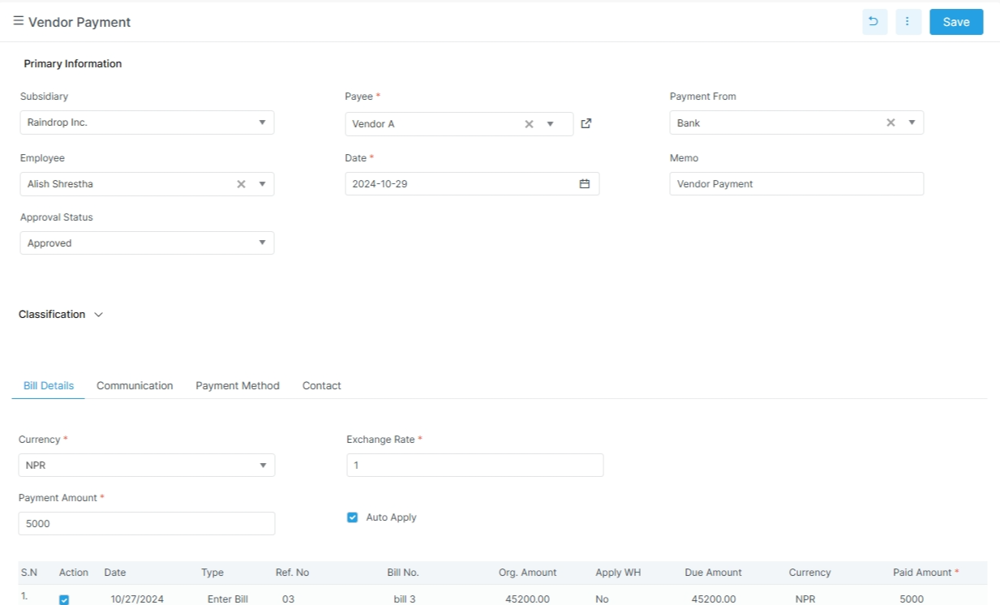

# Vendor Payment

This page covers the vendor payment flow.
Use it when Bizak pays a supplier.

## Before you start

- Confirm the vendor bill or allocation is ready.
- Confirm the payment account is correct.
- Confirm the user can post payments.
- Confirm currency and bank details if they apply.

!!! note "Keep the bill trail clear"
    Link the payment to the vendor and the right bill lines.
    That makes reconciliation easier later.

## What the screen tracks

| Field | Meaning |
| --- | --- |
| `payment_no` | Payment number |
| `vendor_name` | Vendor name |
| `date` | Payment date |
| `ledger_name` | Ledger |
| `payment_amount` | Amount paid |
| `remaining_balance` | Remaining balance |
| `currency_name` | Currency |
| `exchange_rate` | Exchange rate |
| `payment_method` | Payment method |
| `bank_name` | Bank name |
| `cheque_no` | Cheque number |
| `cheque_date` | Cheque date |
| `account` | Account label |
| `details` | Bill allocation lines |

## Example

The accounts team pays a vendor after a bill is approved.
The payment records the method, the amount, and the related bill allocations.

## Related pages

- [Payment Overview](../payment.md)
- [Enter Bill](../procurement/enter-bill.md)
- [Bank](../bank.md)
- [Account Reports](../../reports/account-reports.md)
