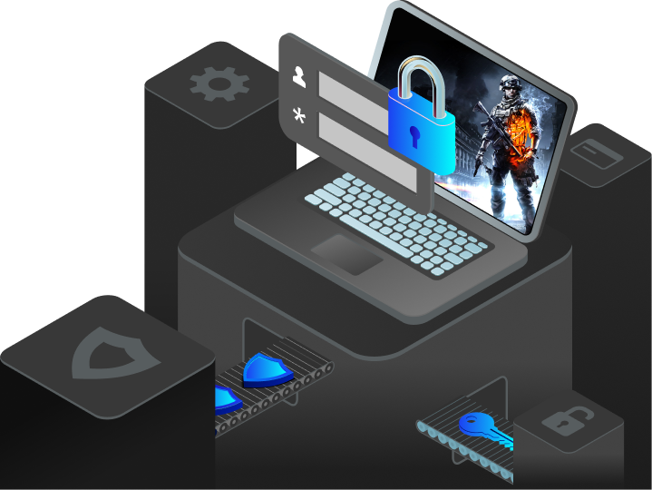

# POS Setup

This page covers POS setup.
Use it before the first sale in a terminal or store.

## What the screen does

- It loads the default customer.
- It loads the default payment method.
- It loads the default warehouse.
- It loads the default organisation.
- It stores the default layout and tax settings.
- It checks for an active session before sending the user to POS.

## What to notice on the setup screen

- The defaults decide what the cashier sees first.
- The warehouse and payment method control the daily sale path.
- A missing session pushes the user to session start.

If all required defaults exist, the app can go straight to the POS screen.
If no session is open, it sends the user to session start first.

!!! tip "Why this matters"
    POS setup reduces repeat work.
    It also keeps the cashier on the correct counter, warehouse, and payment path.

## Example

A store manager sets the defaults once for a location.
Cashiers then use the same POS setup without repeating the same choices every time.
