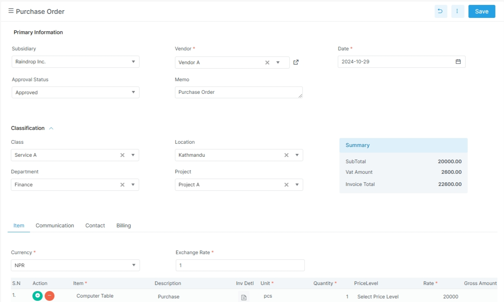
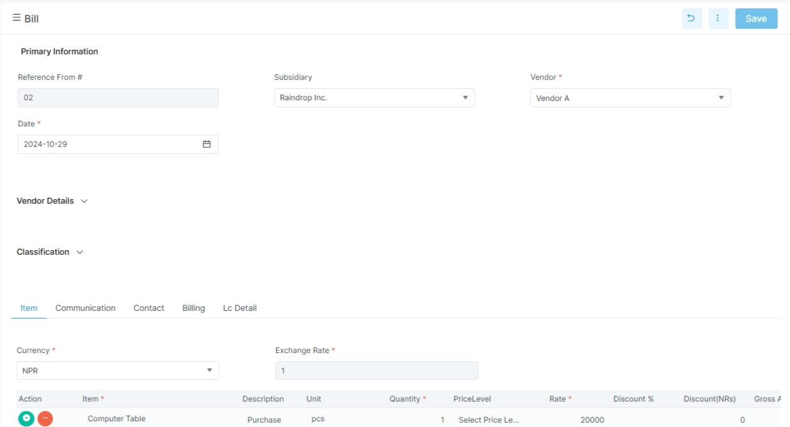

# Procurement

The Procurement module supports supplier and purchasing workflows.

## Visual guide

!!! note "Purchase order layout"
    The top section holds the vendor and classification fields.
    The summary panel appears on the right.
    The item grid sits below the tabs.

!!! tip "What to notice in this screen"
    The vendor, date, and approval fields stay near the top.
    The summary panel shows totals before you scroll.
    The tab row groups item, communication, contact, and billing details.

!!! tip "Bill entry"
    Enter bill follows the same pattern.
    Keep the vendor, date, and receipt reference aligned with the purchase order.

!!! note "What changes on the bill screen"
    The bill uses the same header style as purchase order.
    The receipt reference helps match the goods received step.
    Landed cost and account lines appear when they are part of the purchase.

## Before you start

- Confirm the vendor record exists.
- Confirm items, units, and taxes are ready.
- Confirm the buyer or procurement role has access.
- Confirm the company setup for location, department, and currency.

## Main routes in the app

| Route | Purpose |
| --- | --- |
| `supplier-quotation` | Capture a supplier quotation |
| `purchase` | Create and manage purchase orders |
| `enterbill` | Enter vendor bills |
| `vendor-credit` | Record vendor credit notes |

## Related pages

- [Master Data](master-data.md)
- [Supplier Quotation](procurement/supplier-quotation.md)
- [Purchase Order](procurement/purchase-order.md)
- [Item Receipt](procurement/item-receipt.md)
- [Enter Bill](procurement/enter-bill.md)
- [Vendor Payment](payment/vendor-payment.md)
- [Procurement Reports](../reports/procurement-reports.md)

## Supplier quotation

The current supplier quotation screen uses a purchase-order style form.
The frontend form collects these fields:

| Field | Meaning |
| --- | --- |
| `vendor_id` | Vendor |
| `date` | Quotation date |
| `vendor_bill` | Vendor bill reference |
| `memo` | Notes |
| `approval_status` | Approval status |
| `next_approver` | Next approver |
| `term` | Payment terms |
| `location_id` | Location |
| `department_id` | Department |
| `po_type` | Purchase type |
| `job_card_id` / `job_card_no` | Job card references |
| `currency_id` / `exchange_rate` | Currency handling |
| `subsidiary_id` | Subsidiary |
| `project_id` | Project |
| `order_details` | Line items |
| `lc_details` | LC details |
| `user_note_details` | Notes |
| `file_details` | Attachments |
| `relationship_details` | Related contacts |

## Purchase order

The purchase order DTO includes:

| Field | Meaning |
| --- | --- |
| `order_number` | Purchase order number |
| `vendor_name` | Vendor name |
| `date` | Order date |
| `due_date` | Due date |
| `memo` | Notes |
| `vendor_bill` | Vendor bill reference |
| `term_name` | Payment terms |
| `incoterm_name` | Incoterm |
| `currency_name` / `exchange_rate` | Currency handling |
| `department_name` / `location_name` / `project_name` / `class_name` | Segmentation |
| `approval_status_name` | Approval state |
| `po_type` | Purchase order type |
| `procurement_person` | Buyer name |
| `received_date` | Goods received date |
| `vendor_price_ref` | Vendor price reference |
| `order_details` | Item lines |
| `account_details` | Account lines |

## Item receipt

The item receipt DTO includes:

| Field | Meaning |
| --- | --- |
| `receipt_no` | Receipt number |
| `vendor_name` | Vendor name |
| `date` | Receipt date |
| `reference_from` | Source document |
| `location_name` | Warehouse or location |
| `source_location` | Source location reference |
| `project_name` | Project |
| `department_name` | Department |
| `class_name` | Class |
| `transport` / `transport_amount` | Freight and transport |
| `truck_no` / `driver_name` | Logistics details |
| `pp_number` / `pp_date` | Document references |
| `lc` / `ci_number` | Import or customs references |
| `approval_status_type` | Approval state |
| `recipient_details` | Received items |
| `landed_cost_details` | Landed cost allocation |

## Enter bill

The enter bill DTO includes:

| Field | Meaning |
| --- | --- |
| `bill_no` | Bill number |
| `vendor_name` | Vendor name |
| `date` | Bill date |
| `vendor_bill_date` | Vendor invoice date |
| `due_date` | Payment due date |
| `memo` | Notes |
| `project_name` | Project |
| `location_name` | Location |
| `department_name` | Department |
| `currency_name` / `exchange_rate` | Currency handling |
| `procurement_type` | Procurement type |
| `requisition_type` | Requisition type |
| `reference_receipt` | Linked receipt reference |
| `pragyapan_patra_no` | Import or customs reference |
| `incoterm_name` | Incoterm |
| `is_imported` / `is_capitalized` | Special purchase flags |
| `purpose` | Purchase purpose |
| `is_payment_hold` | Payment hold flag |
| `details` | Item lines |
| `account_details` | Account lines |
| `landed_cost_details` | Landed cost allocation |

## Vendor credit

The vendor credit DTO includes:

| Field | Meaning |
| --- | --- |
| `credit_no` | Credit note number |
| `vendor_name` | Vendor name |
| `date` | Credit date |
| `bill_number` | Linked bill number |
| `bill_date` | Bill date |
| `ledger_name` | Ledger link |
| `location_name` | Location |
| `class_name` / `department_name` / `project_name` | Segmentation |
| `is_imported` / `is_capitalized` | Purchase context flags |
| `details` | Item details |
| `account_details` | Account details |

## Detailed pages

- [Supplier Quotation](procurement/supplier-quotation.md)
- [Purchase Order](procurement/purchase-order.md)
- [Item Receipt](procurement/item-receipt.md)
- [Enter Bill](procurement/enter-bill.md)
- [Vendor Credit](procurement/vendor-credit.md)

## Example procurement flow

1. Create a supplier quotation if needed.
2. Issue a purchase order.
3. Receive the goods.
4. Enter the vendor bill.
5. Record a vendor credit if needed.
6. Review vendor outstanding reports.

## Practical note

Procurement records also store notes, tasks, files, relationships, and approval data.
That helps the team trace the full buying process.
