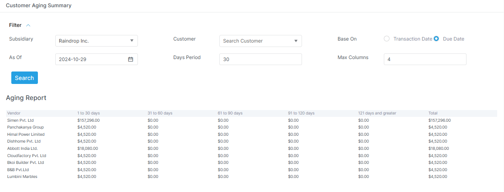

# Account Reports

Account reports show the financial result of posted transactions.

## Visual guide

!!! note "Read ageing reports carefully"
    These screens show overdue balances by time bucket.
    They help the team see what is due now and what is overdue.

## Common reports

- trial balance
- customer ledger
- vendor ledger
- bank ledger
- general ledger
- balance sheet
- profit and loss
- cash flow
- budget vs actual
- ageing reports
- employee ledger

## What to use them for

- Use ledgers when you need transaction history.
- Use trial balance when you need debit and credit totals.
- Use the balance sheet when you need financial position.
- Use profit and loss when you need performance.
- Use cash flow when you need cash movement.
- Use ageing when you need overdue balances.
- Use budget vs actual when you need plan versus result.

## What these reports help with

- reconciliation
- audit review
- period close
- receivable and payable visibility
- management reporting

## Real report names in the app

| Report | Purpose |
| --- | --- |
| `trial-balance` | Balance of debits and credits |
| `trial-balance/tree` | Tree style trial balance |
| `trial-balance/v2` | Alternate trial balance view |
| `trial-balance/tree/expanded` | Expanded tree view |
| `customer-ledger` | Customer transaction history |
| `vendor-ledger` | Vendor transaction history |
| `bank-ledger` | Bank transaction history |
| `general-ledger` | General ledger detail |
| `balance-sheet` | Financial position |
| `profit-and-loss` | Profit and loss |
| `cash-flow` | Cash movement view |
| `budget-vs-actual` | Budget comparison |
| `customer-ageing` | Customer ageing |
| `vendor-ageing` | Vendor ageing |
| `employee-ledger` | Employee ledger view |

## Notes

Some reports have alternate views.
For example, trial balance has tree and expanded tree screens.
Balance sheet and profit and loss also use parameterized routes in the app.
