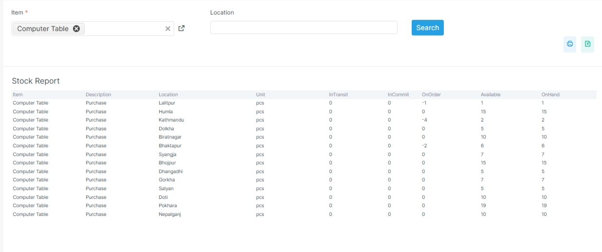

# Inventory Reports

Inventory reports help users track stock quantity and valuation.

## Before you start

- Confirm the stock movement or adjustment is posted.
- Confirm the item and location filters are correct.
- Confirm the user has access to inventory reporting.
- Confirm the valuation rules are set up.

## Visual guide

!!! note "Stock reports are filter first"
    Start with the item, location, or date filter.
    Then review quantity, movement, and valuation in the table below.

## Common examples

- inventory valuation
- adjustment reports
- expiry reports
- batch and serial reports
- stock summary
- stock availability
- stock ledger
- reorder report

## What these reports answer

- How much stock do we have?
- Where is the stock moving?
- What stock value sits in the books?
- Which items are ageing?
- Which items need reorder?

## Real report names in the app

| Report | Purpose |
| --- | --- |
| `stock-report` | Stock ledger summary |
| `stock-detail` | Stock ledger detail |
| `inventory-ledger` | Inventory ledger |
| `inventory-valuation-summary` | Valuation summary |
| `inventory-valuation-detail` | Valuation detail |
| `inventory-valuation-report` | Valuation report |
| `valuation` | Inventory valuation view |
| `valuation-detail` | Inventory valuation detail view |
| `movement` | Stock movement view |
| `movement-detail` | Stock movement detail |
| `inventory-movement-summary` | Movement summary |
| `inventory-movement-detail` | Movement detail |
| `stock-availability` | Stock availability |
| `stock-summary` | Stock summary |
| `inventory-aging` | Inventory ageing |
| `adjustment` | Inventory adjustment report |
| `reorder-report` | Reorder report |

## Notes

Some routes show a summary view.
Some routes show a detail view.
That gives the user both fast review and drilldown options.

## Related pages

- [Reports Overview](index.md)
- [Inventory Overview](../modules/inventory.md)
- [Transfer Order](../modules/inventory/transfer-order.md)
- [Inventory Adjustment](../modules/inventory/inventory-adjustment.md)
