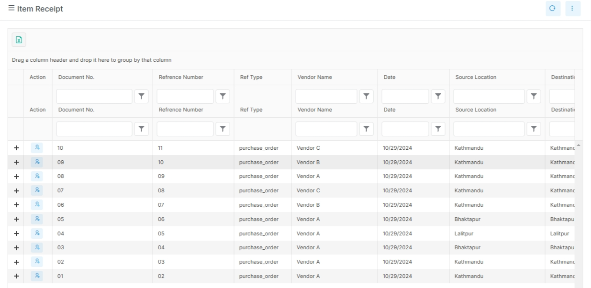

# Procurement Reports

Procurement reports support purchasing control and supplier monitoring.

## Before you start

- Confirm the purchase order or bill is posted.
- Confirm the vendor filter is correct.
- Confirm the date range is correct.
- Confirm the user has access to procurement reports.

## Visual guide

!!! note "Use it for purchase follow-up"
    These pages help buyers review what was ordered, received, and still owed.
    They are useful during vendor review and period close.

!!! tip "What to notice in procurement reports"
    Purchase history shows the order trail.
    Vendor outstanding reports help with payment follow-up.
    A receipt list is useful when you need to confirm what arrived.

## Common examples

- purchase order history
- vendor outstanding reports
- purchase register

## What these reports answer

- What purchase orders were issued?
- Which vendor balances are still open?
- Which orders need follow-up?

## Real report names in the app

| Report | Purpose |
| --- | --- |
| `purchase-order-history-summary` | Purchase order history summary |
| `purchase-order-history-detail` | Purchase order history detail |
| `vendor-outstanding-report` | Outstanding vendor balances |
| `vendor-outstanding-detail` | Vendor outstanding detail |

## Notes

Use the detail pages when a buyer or accountant needs the line-level trail.

## Related pages

- [Reports Overview](index.md)
- [Procurement Overview](../modules/procurement.md)
- [Purchase Order](../modules/procurement/purchase-order.md)
- [Enter Bill](../modules/procurement/enter-bill.md)
